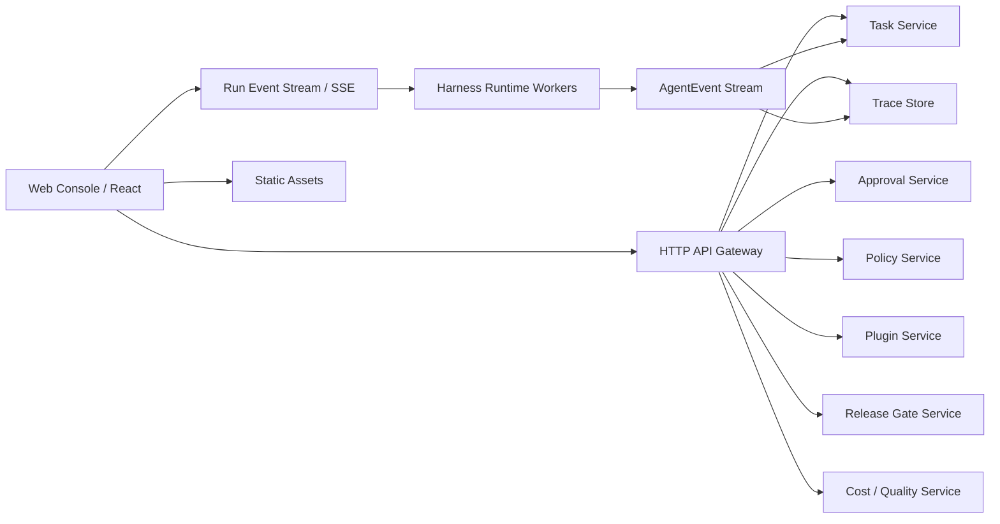

# Harness 前端工程实现路线图

## 1. 目标与边界

本文档基于 Figma 设计文件 [Harness Learn - Product UI Design](https://www.figma.com/design/9aWcyA4rufac4cFjZoBxCB) 和当前 Harness 后端核心能力，定义前端工程的实现路线图。

前端目标不是做一个聊天壳，而是提供一个面向 Agent Runtime 的控制台：

- 任务创建、查看、恢复和取消。
- Run / Trace / Tool / Permission 的可观测视图。
- 人工审批与规则沉淀。
- Release Gate、Replay Eval、成本与质量趋势。
- 团队策略、模型白名单、工具白名单、插件与 Skill 分发。

架构原则：

- 前后端分离，前端不直接 import 后端 `src/*` 运行时代码。
- 前端只依赖公开 API、事件流协议和生成的类型契约。
- 后端负责执行、权限、安全、持久化和审计。
- 前端负责交互、状态展示、审批操作入口和可视化诊断。

## 2. Figma 页面到前端模块映射

| Figma 画板 | 前端路由 | 核心模块 | 后端能力依赖 |
|---|---|---|---|
| `01 Task Center / Overview` | `/tasks` | Task Center、任务列表、运行健康摘要 | Task Service、CostQualityDashboard、ReleaseGate |
| `02 Run Detail / Trace Timeline` | `/tasks/:taskId/runs/:runId` | Run Detail、Trace Timeline、事件详情 | AgentEvent、TraceCollector、Task Service |
| `03 Approval Queue` | `/approvals` | 审批队列、风险解释、规则建议 | Permission Engine、ApprovalStore、AuditLog |
| `04 Release Readiness` | `/releases/:releaseId` | Release Gate、证据、JSONL 导出 | ReleaseGate、ReadinessReport、EvalGate |
| `05 Team Policy and Plugins` | `/settings/policy`、`/settings/plugins` | 项目策略、模型/工具白名单、插件管理 | TeamPolicyCenter、PluginRegistry |
| `06 Design System Notes` | 前端设计系统文档 | Token、组件规范、交互原则 | 无直接运行时依赖 |

## 3. 前后端分离架构



### 3.1 前端职责

- 页面路由、布局、交互和可视化。
- 调用 API 获取任务、Trace、审批、策略、插件、发布报告。
- 通过 SSE 或 WebSocket 消费运行事件流。
- 将审批操作提交给后端。
- 使用乐观状态或轮询降低等待感，但不自行判定权限结果。

### 3.2 后端职责

- Agent Runtime 执行。
- 工具调用、权限决策、审批记录。
- 任务、事件、检查点、Trace、审计持久化。
- Release Gate、Replay Eval、成本质量统计。
- 团队策略、插件安装与启用。

### 3.3 契约边界

前端可以共享类型，但不能共享后端实现。

推荐方式：

```text
apps/web                  # 前端应用
apps/api                  # 后端 API 服务，包装当前 Harness Core
packages/contracts        # OpenAPI schema / generated TypeScript types
packages/ui               # 前端 UI 组件库
src                       # 当前 Harness Core，后端使用
```

约束：

- `apps/web` 不允许 import `src/runtime/*`、`src/tools/*` 等后端运行时代码。
- `apps/web` 只允许 import `packages/contracts` 和 `packages/ui`。
- API 变更先更新契约，再更新前端调用。

## 4. 推荐技术栈

| 层 | 推荐 | 原因 |
|---|---|---|
| Web 框架 | React + Vite | 当前仓库 TypeScript 优先，Vite 简洁，适合控制台 MVP |
| 路由 | React Router | 页面清晰，适合任务、运行、设置等嵌套路由 |
| 数据请求 | TanStack Query | 服务端状态、缓存、重试和失效管理成熟 |
| 表格 | TanStack Table | 任务、审批、插件、审计列表都需要可扩展表格 |
| 事件流 | 原生 `EventSource` + 封装 hook | Run 事件适合 SSE，复杂协作后再升级 WebSocket |
| 图表 | Recharts 或 Tremor Charts | 成本、质量、运行趋势先轻量实现 |
| 样式 | CSS Modules 或 Tailwind CSS | 控制台需要高密度、稳定布局；Tailwind 可以快速落地 |
| Mock | MSW | 前后端并行开发，先用契约 mock Figma 页面数据 |
| 测试 | Vitest + Testing Library + Playwright | 单元、交互、端到端分层验证 |
| API 契约 | OpenAPI + `openapi-typescript` | 保持前后端分离，同时获得类型安全 |

## 5. API 契约优先级

### 5.1 Task API

```http
GET    /api/v1/tasks
POST   /api/v1/tasks
GET    /api/v1/tasks/:taskId
POST   /api/v1/tasks/:taskId/cancel
POST   /api/v1/tasks/:taskId/resume
GET    /api/v1/tasks/:taskId/runs
GET    /api/v1/tasks/:taskId/runs/:runId/events
GET    /api/v1/tasks/:taskId/checkpoints/latest
```

### 5.2 Run Event Stream

```http
GET /api/v1/tasks/:taskId/runs/:runId/stream
```

返回 SSE：

```text
event: agent.event
data: {"type":"tool.requested","taskId":"...","runId":"..."}
```

### 5.3 Approval API

```http
GET  /api/v1/approvals?status=pending
POST /api/v1/approvals/:approvalId/approve
POST /api/v1/approvals/:approvalId/deny
POST /api/v1/policies/suggestions/:suggestionId/apply
```

### 5.4 Trace API

```http
GET /api/v1/traces/:traceId
GET /api/v1/tasks/:taskId/runs/:runId/trace
GET /api/v1/traces/:traceId/replay-case
```

### 5.5 Release API

```http
GET  /api/v1/releases
POST /api/v1/releases/:releaseId/gate
GET  /api/v1/releases/:releaseId/readiness
GET  /api/v1/releases/:releaseId/audit.jsonl
```

### 5.6 Team / Policy / Plugin API

```http
GET  /api/v1/projects/:projectId/policy
PUT  /api/v1/projects/:projectId/policy
POST /api/v1/projects/:projectId/policy/simulate

GET  /api/v1/teams/:teamId/plugins
POST /api/v1/teams/:teamId/plugins/:pluginId/install
POST /api/v1/teams/:teamId/plugins/:pluginId/enable
POST /api/v1/teams/:teamId/plugins/:pluginId/disable
```

## 6. 前端目录建议

```text
apps/web/
  src/
    app/
      router.tsx
      providers.tsx
      layouts/
    pages/
      tasks/
      run-detail/
      approvals/
      releases/
      settings-policy/
      settings-plugins/
    features/
      task-center/
      trace-timeline/
      approval-queue/
      release-readiness/
      team-policy/
      plugin-registry/
      runtime-metrics/
    shared/
      api/
        client.ts
        queryKeys.ts
        sse.ts
      components/
      design-tokens/
      formatters/
      fixtures/
      test/
```

设计原则：

- `pages/*` 只做路由组合。
- `features/*` 按业务能力组织组件、hooks、view-model。
- `shared/api` 封装所有后端调用。
- `shared/fixtures` 支持无后端 mock 验证。
- UI 组件与业务组件分离，避免后续重构痛苦。

## 7. 实施路线图

### 阶段 F0：前端工程基线

目标：建立独立前端工程骨架和契约开发方式。

范围：

- 创建 `apps/web`。
- 配置 React、Vite、TypeScript。
- 建立路由、布局、测试、lint、format。
- 建立 `packages/contracts`。
- 建立 MSW mock server。

验收标准：

- `npm run dev:web` 可以启动 Web Console。
- `npm run test:web` 可以运行前端单元测试。
- 前端可以用 mock API 渲染空壳页面。
- 前端不 import 后端 `src/*`。

### 阶段 F1：设计系统与 App Shell

目标：把 Figma 的视觉系统转成可复用前端组件。

范围：

- App Shell：Sidebar、Topbar、内容区域。
- 基础组件：Button、Badge、Card、Table、MetricCard、ProgressBar、CodeBlock。
- 状态组件：Empty、Loading、Error、PermissionRiskBadge。
- 设计 token：颜色、间距、圆角、字体、状态色。

验收标准：

- 5 个核心页面共享同一套导航与布局。
- 颜色和状态语义与 Figma 一致。
- 组件支持键盘焦点和基础可访问性。

### 阶段 F2：Task Center

目标：实现任务入口和任务列表。

范围：

- `/tasks` 页面。
- 任务列表、状态筛选、搜索、排序。
- 新建任务 drawer 或 modal。
- 任务健康摘要：active、waiting approval、release gates、cost today。
- 任务详情跳转。

后端依赖：

- `GET /api/v1/tasks`
- `POST /api/v1/tasks`
- `GET /api/v1/releases/summary`
- `GET /api/v1/metrics/summary`

验收标准：

- 用户可以创建任务并看到任务进入列表。
- 用户可以按状态查看任务。
- 任务状态视觉清晰区分 pending、running、waiting、completed、failed。

### 阶段 F3：Run Detail 与 Trace Timeline

目标：让用户能解释一次 Agent 运行发生了什么。

范围：

- `/tasks/:taskId/runs/:runId` 页面。
- Trace Timeline。
- Event Detail Panel。
- Tool input/output 展示。
- 大输出引用跳转。
- SSE 实时更新。
- Replay Case 入口。

后端依赖：

- `GET /api/v1/tasks/:taskId/runs/:runId/trace`
- `GET /api/v1/tasks/:taskId/runs/:runId/stream`
- `GET /api/v1/tool-outputs/:ref`
- `GET /api/v1/traces/:traceId/replay-case`

验收标准：

- Run 执行中页面可以实时追加事件。
- 用户可以定位失败模块。
- 用户可以查看权限请求、工具调用和模型输出。

### 阶段 F4：Approval Queue

目标：闭合人工审批体验。

范围：

- `/approvals` 页面。
- 待审批列表。
- 审批详情。
- Approve / Deny 操作。
- 风险解释。
- 规则建议卡片。

后端依赖：

- `GET /api/v1/approvals?status=pending`
- `POST /api/v1/approvals/:approvalId/approve`
- `POST /api/v1/approvals/:approvalId/deny`
- `POST /api/v1/policies/suggestions/:suggestionId/apply`

验收标准：

- 用户能看到每个审批为什么需要确认。
- 审批后队列更新，相关 run 继续或失败。
- 高风险操作有更强视觉提示。

### 阶段 F5：Release Readiness

目标：把 Eval、成本、质量、审计整合成发布前检查页。

范围：

- `/releases` 列表。
- `/releases/:releaseId` 详情。
- Gate checks。
- Evidence table。
- Audit JSONL 导出。
- Blocked release 的原因展示。

后端依赖：

- `GET /api/v1/releases`
- `GET /api/v1/releases/:releaseId/readiness`
- `POST /api/v1/releases/:releaseId/gate`
- `GET /api/v1/releases/:releaseId/audit.jsonl`

验收标准：

- 用户可以判断 release 是 ready 还是 blocked。
- blocked 状态给出明确原因。
- 可以导出审计证据。

### 阶段 F6：Team Policy 与 Plugins

目标：提供团队治理和扩展管理界面。

范围：

- `/settings/policy`。
- 模型白名单。
- 工具白名单。
- 策略模拟器。
- `/settings/plugins`。
- 插件列表、安装、启用、禁用。
- Team shared skills 可视化。

后端依赖：

- `GET /api/v1/projects/:projectId/policy`
- `PUT /api/v1/projects/:projectId/policy`
- `POST /api/v1/projects/:projectId/policy/simulate`
- `GET /api/v1/teams/:teamId/plugins`
- plugin install / enable / disable APIs

验收标准：

- 管理员可以限制项目可用模型和工具。
- 保存策略前可以模拟结果。
- 插件状态和提供能力清晰可见。

### 阶段 F7：Metrics、质量与成本分析

目标：将运营指标产品化。

范围：

- `/metrics` 页面。
- 模型成本趋势。
- 工具调用成本。
- Skill 成本归因。
- Eval 质量趋势。
- Run 成功率、平均迭代次数、等待审批时长。

后端依赖：

- `GET /api/v1/metrics/cost`
- `GET /api/v1/metrics/quality`
- `GET /api/v1/metrics/runtime`

验收标准：

- 用户可以按项目、模型、工具、Skill 查看成本。
- 用户可以发现质量回退趋势。
- 指标口径与 Release Gate 使用的口径一致。

### 阶段 F8：生产化与安全收口

目标：让 Web Console 可进入团队 dogfood。

范围：

- Auth / session。
- RBAC：viewer、developer、admin。
- API 错误边界。
- 审批操作二次确认。
- 前端审计埋点。
- 可访问性检查。
- E2E 测试。
- 性能预算。

验收标准：

- 非管理员不能修改项目策略。
- 危险审批操作有明确确认。
- 核心页面 Playwright E2E 通过。
- 首屏和 Trace 页面在大数据量下仍可用。

## 8. 前端状态模型

### 8.1 服务端状态

使用 TanStack Query 管理：

- tasks
- runs
- traces
- approvals
- releases
- policies
- plugins
- metrics

### 8.2 实时状态

Run 事件使用 SSE：

- 初次进入 Run Detail：先拉取历史 trace。
- 运行中：订阅 SSE。
- SSE 事件进入本地 timeline buffer。
- Run 完成后：失效 task、trace、approval、metrics 查询。

### 8.3 本地 UI 状态

使用组件 state 或轻量 store 管理：

- 当前选中的 trace event。
- 表格筛选、排序、分页。
- drawer / modal 打开状态。
- command palette。

不建议把服务端数据复制进全局 store。

## 9. Mock 与并行开发策略

前端不应等待后端全部完成。

建议顺序：

1. 先定义 OpenAPI schema。
2. 用 MSW 根据 schema 生成 mock。
3. 前端按 Figma 完成交互。
4. 后端逐步替换 mock endpoint。
5. 用契约测试防止 API 漂移。

Mock 数据应覆盖：

- running / waiting_approval / completed / failed task。
- 成功 trace、权限等待 trace、失败 trace。
- ready release、blocked release。
- admin 和 viewer 两种权限。

## 10. 测试策略

| 层级 | 工具 | 覆盖 |
|---|---|---|
| 单元测试 | Vitest | formatters、view-model、hooks |
| 组件测试 | Testing Library | 表格、Timeline、Approval Card |
| Mock API 测试 | MSW | API loading/error/success |
| E2E | Playwright | 创建任务、审批、查看 Trace、Release Gate |
| 可访问性 | axe-playwright | 键盘导航、颜色对比、语义标签 |

关键 E2E 用例：

- 创建任务后进入任务列表。
- 运行详情页面实时收到 `permission.requested`。
- 审批通过后审批队列减少。
- Release Gate blocked 时展示失败原因。
- 管理员更新项目模型白名单。

## 11. 风险与对策

| 风险 | 表现 | 对策 |
|---|---|---|
| 前端直接耦合后端内部类型 | 后端重构破坏 UI | 使用 OpenAPI / contracts 包，不 import 后端实现 |
| Trace 数据过大 | 页面卡顿 | 虚拟列表、事件分组、懒加载 tool output |
| 审批误操作 | 错误放行危险命令 | 风险分级、二次确认、清晰输入预览 |
| API 漂移 | 前后端联调频繁破裂 | 契约测试和 CI 生成类型检查 |
| 指标口径不一致 | Release 与 Metrics 展示冲突 | 后端统一指标聚合，前端只展示结果 |
| 权限前端绕过 | 非管理员看到操作入口 | 后端强校验，前端只做体验层隐藏 |

## 12. 推荐里程碑

| 里程碑 | 阶段 | 目标 | 建议周期 |
|---|---|---|---|
| FW0 | F0-F1 | 前端骨架和设计系统 | 1 周 |
| FW1 | F2-F3 | 任务中心和 Trace 可视化 | 1-2 周 |
| FW2 | F4 | 审批闭环 | 1 周 |
| FW3 | F5 | 发布就绪页 | 1 周 |
| FW4 | F6-F7 | 团队治理和指标 | 1-2 周 |
| FW5 | F8 | dogfood 生产化 | 1 周 |

## 13. 最小可用前端 MVP

如果需要最快验证前端价值，MVP 可以压缩为：

- App Shell。
- Task Center。
- Run Detail + Trace Timeline。
- Approval Queue。
- Release Readiness。
- MSW mock + 少量真实 API。

暂不做：

- 完整插件市场。
- 复杂指标分析。
- 多租户组织管理。
- 高级自定义 dashboard。
- 移动端深度适配。

## 14. 下一步建议

建议下一轮开发从阶段 F0-F1 开始：

1. 创建 `apps/web`。
2. 建立 `packages/contracts`。
3. 用 Figma 页面还原 App Shell 和基础组件。
4. 接入 MSW mock。
5. 完成 `/tasks` 和 `/tasks/:taskId/runs/:runId` 两个页面的静态可交互版本。

这能最快把 Figma 设计转成可运行前端，同时保持后端工程与前端工程清晰分离。
