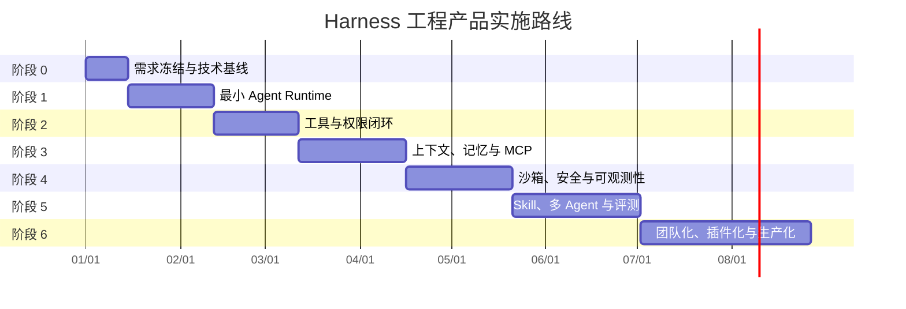
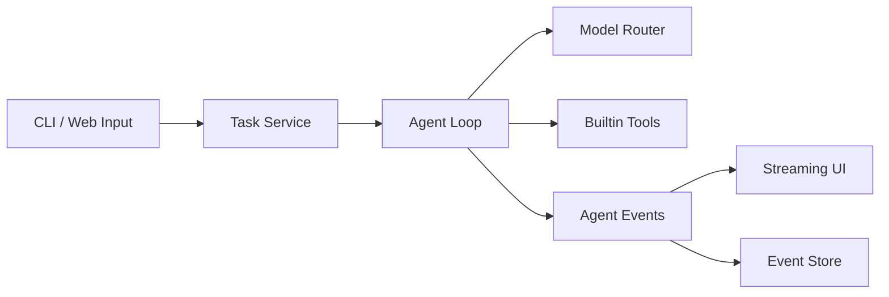
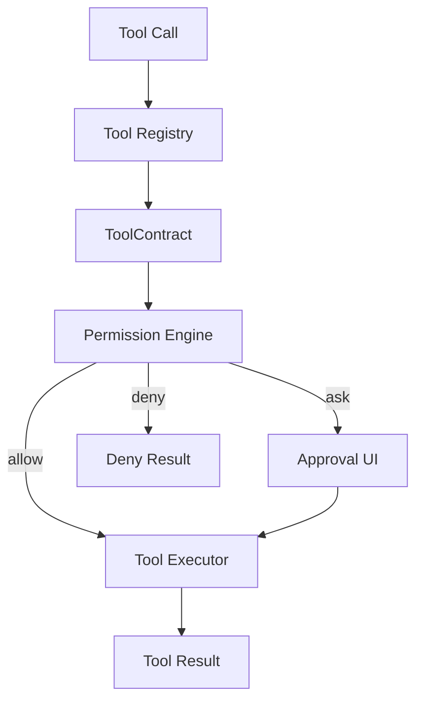
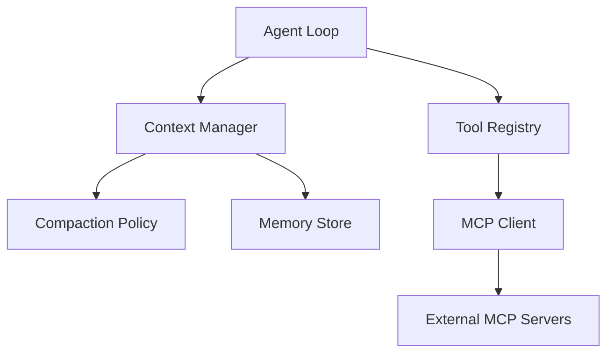
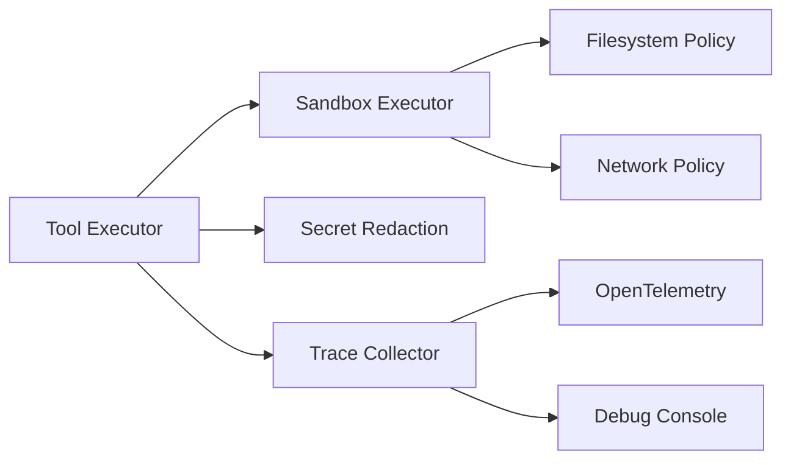
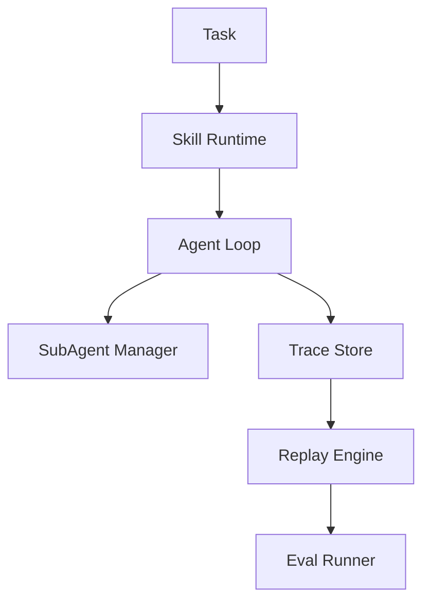
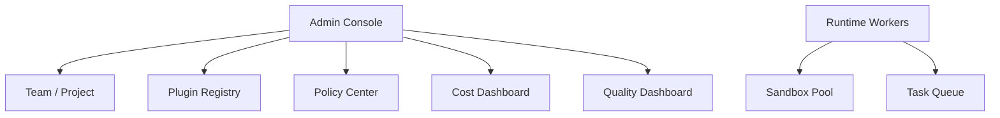
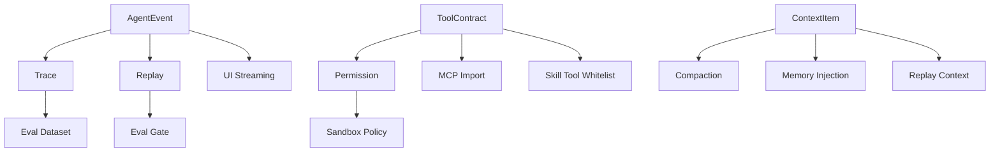

# Harness 工程产品实施路线图

## 1. 路线图目标

本文档基于以下两份设计文档拆解实施路线：

- `reports/harness-product-design-and-requirements.md`
- `reports/harness-technical-selection-and-architecture.md`

目标是将 Harness 工程产品从概念设计拆解为可执行的阶段计划，明确每个阶段的目标、范围、交付物、依赖关系、验收标准和主要风险。

本路线图遵循一个核心原则：

> 先闭合最小可靠执行链路，再逐步扩展工具、上下文、安全、观测、评测和团队协作能力。

## 2. 总体阶段划分

实际排期应根据团队规模调整。上图按 4-6 人核心工程团队估算。

## 3. 阶段 0：需求冻结与技术基线

### 3.1 阶段目标

确认产品边界、MVP 范围、技术栈和工程规范，避免在实现期反复摇摆。

### 3.2 核心问题

- 首个入口选择 CLI、Web、Desktop 还是 IDE？
- Runtime 使用 TypeScript 还是 Python？
- 目标场景优先代码工程、研究报告，还是企业自动化？
- MVP 是否需要云端沙箱，还是先本地执行？
- 是否必须支持多模型，还是先支持 1-2 个主流模型？

### 3.3 推荐决策

| 事项 | 推荐 |
|---|---|
| 首个入口 | CLI + 简单 Web Console |
| Runtime 语言 | TypeScript 优先 |
| API 服务 | Fastify / NestJS |
| 数据库 | PostgreSQL + pgvector |
| 队列 | Redis + BullMQ |
| 模型层 | LiteLLM + OpenAI / Anthropic SDK 兜底 |
| 工具协议 | 内置工具 + MCP SDK |
| 观测 | OpenTelemetry + Langfuse |
| 沙箱 | MVP 用本地 workspace 限制，后续接 Docker / E2B |

### 3.4 交付物

- 产品 MVP 范围说明。
- 技术栈决策记录。
- 模块边界图。
- 数据模型草案。
- 权限模式草案。
- 工具契约草案。
- 评测基线草案。

### 3.5 验收标准

- 团队能明确回答「MVP 不做什么」。
- 主要技术选型有明确理由和替代方案。
- Harness Core 与开源组件边界清楚。

## 4. 阶段 1：最小 Agent Runtime

### 4.1 阶段目标

实现一个最小可运行的 Agent Loop，让用户能够提交任务，模型能够流式响应，并在需要时调用少量内置工具。

### 4.2 范围

包含：

- 任务创建。
- Agent Run 生命周期。
- LLM 流式调用。
- 工具调用解析。
- 工具结果回写。
- 最大迭代次数。
- 用户取消。
- 基础事件流。

不包含：

- 完整权限系统。
- MCP。
- Skill。
- 多 Agent。
- 复杂上下文压缩。
- 沙箱执行。

### 4.3 关键模块

### 4.4 核心任务

1. 建立项目骨架。
2. 实现任务表与运行表。
3. 实现 `AgentRunConfig`。
4. 实现 `AgentEvent` 事件协议。
5. 接入一个模型供应商。
6. 实现流式输出。
7. 实现工具调用解析。
8. 实现 3 个内置只读工具：
   - `read_file`
   - `list_files`
   - `search_text`
9. 实现最大迭代次数。
10. 实现取消信号。

### 4.5 开源组件使用

| 能力 | 组件 |
|---|---|
| 模型调用 | OpenAI SDK / Anthropic SDK / LiteLLM |
| Schema 校验 | Zod 或 Pydantic |
| 文件搜索 | ripgrep |
| 数据持久化 | PostgreSQL |

### 4.6 自研实现

| 能力 | 自研原因 |
|---|---|
| Agent Loop | 是产品核心状态机 |
| AgentEvent | 后续 UI、Trace、Replay、Eval 都依赖统一事件 |
| 工具执行编排 | 需要与权限、上下文、观测深度集成 |

### 4.7 验收标准

- 用户可以发起一个任务并看到流式输出。
- Agent 可以读取文件并基于文件内容回答。
- 工具调用结果能进入下一轮模型上下文。
- 达到最大迭代次数时任务安全终止。
- 用户取消后模型调用和工具执行停止。

### 4.8 主要风险

| 风险 | 对策 |
|---|---|
| 过早引入复杂框架 | Runtime Core 保持自研，框架只做参考 |
| 工具调用格式不稳定 | 模型适配器统一转换为内部 ToolCall |
| 事件协议设计过粗 | 从第一天记录 taskId、runId、callId、timestamp |

## 5. 阶段 2：工具与权限闭环

### 5.1 阶段目标

从「能调用工具」升级为「能安全调用工具」。建立 ToolContract、权限判断和审批机制。

### 5.2 范围

包含：

- Tool Registry。
- ToolContract。
- 工具分层加载。
- 只读 / 写入 / 高风险分类。
- 基础权限模式。
- 审批事件。
- 先读后写校验。
- 工具输出大小限制。

### 5.3 关键模块

### 5.4 核心任务

1. 定义 `ToolContract`。
2. 将阶段 1 的内置工具迁移到 Tool Registry。
3. 增加写文件工具 `write_file`。
4. 实现先读后写校验。
5. 实现命令执行工具 `run_command`，默认需要审批。
6. 实现权限模式：
   - `read_only`
   - `default`
   - `accept_edits`
   - `auto`
7. 实现审批请求事件。
8. 实现审批结果持久化。
9. 实现工具输出限制：
   - 小结果直接回写。
   - 大结果落盘并返回引用。
10. 实现工具禁用配置。

### 5.5 开源组件使用

| 能力 | 组件 |
|---|---|
| Schema | Zod / Pydantic |
| 命令执行 | Node child_process / Python subprocess |
| 策略规则 | OPA / Casbin 可暂缓，先自研简单规则 |

### 5.6 自研实现

| 能力 | 自研原因 |
|---|---|
| ToolContract | 开源工具声明缺少权限、并发、安全元数据 |
| Permission Engine | Agent 权限控制的是语义意图，不是传统资源 |
| 先读后写 | 直接防止文件幻觉覆盖事故 |
| 审批事件 | 需要进入 UI、Trace 和 Replay |

### 5.7 验收标准

- 写文件前如果未读取目标文件，工具会拒绝执行。
- 命令执行默认进入审批。
- 用户审批结果被记录并可查询。
- 被禁用工具不会被注入，也不会在执行层执行。
- 大工具结果不会直接塞爆上下文。

## 6. 阶段 3：上下文、记忆与 MCP

### 6.1 阶段目标

让 Harness 支持更长任务和外部工具生态，解决上下文增长和工具扩展问题。

### 6.2 范围

包含：

- Context Manager。
- token 估算。
- 分层上下文压缩。
- 工具结果引用。
- 基础记忆系统。
- MCP client。
- MCP server 注册、启用、禁用。
- MCP 工具权限默认保守。

### 6.3 关键模块

### 6.4 核心任务

1. 实现 token 估算。
2. 定义 `ContextItem`。
3. 实现上下文优先级：
   - 用户目标。
   - 系统约束。
   - 当前任务状态。
   - 工具事实。
   - 可压缩历史。
   - 可丢弃冗余。
4. 实现轻量压缩。
5. 实现大工具结果引用读取。
6. 实现基础记忆表。
7. 实现任务结束后记忆提取。
8. 接入 pgvector。
9. 实现 MCP client。
10. 实现 MCP 工具导入到 Tool Registry。
11. 实现 MCP 工具懒连接。
12. 实现 MCP 工具超时和结果大小限制。

### 6.5 开源组件使用

| 能力 | 组件 |
|---|---|
| token 估算 | tiktoken |
| 向量存储 | pgvector |
| 文档切分 | LlamaIndex / LangChain splitters |
| MCP | 官方 MCP SDK |

### 6.6 自研实现

| 能力 | 自研原因 |
|---|---|
| Context Policy | 需要保护任务锚点，不能简单滑窗 |
| 记忆写入时机 | 避免当前对话内容自我强化 |
| MCP 治理 | MCP 只解决协议，不解决安全、质量和权限 |

### 6.7 验收标准

- 长对话触发压缩后仍保留用户目标。
- 大结果可以按引用重新读取。
- 任务结束后才写入长期记忆。
- MCP server 连接失败不影响主程序启动。
- MCP 工具默认需要保守权限。

## 7. 阶段 4：沙箱、安全与可观测性

### 7.1 阶段目标

将 Harness 从可用提升到可信：引入执行隔离、安全过滤、结构化 Trace 和调试面板。

### 7.2 范围

包含：

- 本地 sandbox profile。
- 命令执行隔离。
- 网络访问控制。
- 敏感信息过滤。
- OpenTelemetry。
- Langfuse / Phoenix。
- Agent Trace 页面。
- 权限审计页面。

### 7.3 关键模块

### 7.4 核心任务

1. 定义 sandbox profile。
2. 实现 workspace 文件访问边界。
3. 实现命令超时。
4. 实现网络 allowlist。
5. 接入 Docker 或本地进程隔离。
6. 集成 detect-secrets / trufflehog。
7. 实现工具输出脱敏。
8. 实现 LLM 输出脱敏。
9. 集成 OpenTelemetry。
10. 集成 Langfuse 或 Phoenix。
11. 实现 trace ID 贯穿任务、模型、工具、权限。
12. 实现基础 Trace UI。

### 7.5 开源组件使用

| 能力 | 组件 |
|---|---|
| 沙箱 | Docker / bubblewrap / E2B |
| 密钥扫描 | detect-secrets / trufflehog |
| 可观测性 | OpenTelemetry |
| LLM Trace | Langfuse / Phoenix |

### 7.6 自研实现

| 能力 | 自研原因 |
|---|---|
| Sandbox Policy Mapping | 不同工具需要不同隔离策略 |
| Agent Trace Schema | 普通 LLM trace 无法解释工具、权限和上下文压缩 |
| 审批审计 | 需要满足产品安全闭环 |

### 7.7 验收标准

- 命令执行不能越权访问配置外路径。
- 敏感 key 不会被原样送入模型或输出给用户。
- 每次任务都能看到 LLM、工具、权限、压缩事件。
- 可以定位一次失败发生在哪个模块。

## 8. 阶段 5：Skill、多 Agent 与评测

### 8.1 阶段目标

将 Harness 从单次任务执行器升级为可复用、可协作、可回归的 Agent 平台。

### 8.2 范围

包含：

- Skill Runtime。
- Skill 触发与显式调用。
- Skill 工具白名单。
- Skill 版本管理。
- 子 Agent。
- 并行只读任务。
- Trace Replay。
- promptfoo / DeepEval 集成。
- Eval Gate。

### 8.3 关键模块

### 8.4 核心任务

1. 定义 Skill 文件格式。
2. 实现 Skill 加载。
3. 实现显式 Skill 调用。
4. 实现语义触发初筛。
5. 实现 Skill 工具白名单。
6. 实现 Skill 版本备份。
7. 实现 Skill 回滚。
8. 实现子 Agent 创建。
9. 实现子 Agent 上下文隔离。
10. 实现只读子 Agent 并发。
11. 实现子 Agent 结果摘要。
12. 实现 ReplayCase。
13. 从 trace 生成 replay case。
14. 集成 promptfoo。
15. 集成 DeepEval 或自研 judge。
16. 实现发布前 Eval Gate。

### 8.5 开源组件使用

| 能力 | 组件 |
|---|---|
| Skill 格式 | Markdown + YAML frontmatter |
| 版本管理 | Git / PostgreSQL version table |
| Prompt 回归 | promptfoo |
| LLM 评测 | DeepEval / Inspect AI |
| 多 Agent 参考 | LangGraph / AutoGen |

### 8.6 自研实现

| 能力 | 自研原因 |
|---|---|
| Skill Runtime | Skill 需要权限、工具、版本和触发治理 |
| SubAgent Manager | 子 Agent 权限和上下文必须受 Runtime 控制 |
| Replay Engine | Harness 质量关注过程正确性，而不只是最终答案 |
| Eval Gate | 需要绑定真实任务轨迹 |

### 8.7 验收标准

- Skill 不会全量注入上下文。
- 高风险 Skill 可以设置显式调用。
- 子 Agent 中间过程不会污染主 Agent 上下文。
- 历史任务可以 replay。
- Prompt、Skill、工具描述变更可以跑回归。

## 9. 阶段 6：团队化、插件化与生产化

### 9.1 阶段目标

将 Harness 从单用户工具升级为团队级平台，支持插件分发、权限治理、成本分析和生产运维。

### 9.2 范围

包含：

- 团队与项目。
- 用户、角色、权限。
- 插件注册与安装。
- 工具市场。
- 团队 Skill。
- 成本面板。
- 质量面板。
- 多 worker。
- 云端沙箱池。
- 企业审计。

### 9.3 关键模块

### 9.4 核心任务

1. 实现团队和项目模型。
2. 实现用户角色。
3. 实现项目级工具配置。
4. 实现项目级权限规则。
5. 实现插件 manifest。
6. 实现插件安装、启用、禁用。
7. 实现团队 Skill。
8. 实现模型成本统计。
9. 实现工具调用成本统计。
10. 实现质量趋势面板。
11. 实现 worker pool。
12. 实现云端 sandbox pool。
13. 实现审计日志导出。

### 9.5 开源组件使用

| 能力 | 组件 |
|---|---|
| 权限规则 | OPA / Casbin |
| 队列 | BullMQ / Temporal |
| 沙箱池 | E2B / Daytona / gVisor / Firecracker |
| 指标 | Prometheus / Grafana |
| Trace 存储 | Tempo / Jaeger |

### 9.6 自研实现

| 能力 | 自研原因 |
|---|---|
| Plugin Registry | 插件是产品分发和治理单元 |
| Policy Center | 团队安全要求需要映射到 Agent 工具行为 |
| Cost / Quality Dashboard | 需要按任务、模型、工具、Skill 归因 |

### 9.7 验收标准

- 团队可以共享插件和 Skill。
- 管理员可以限制某类工具或模型。
- 每个项目有独立权限策略。
- 可以查看成本和质量趋势。
- 云端任务可以隔离执行。

## 10. 里程碑与发布节奏

| 里程碑 | 阶段 | 发布目标 |
|---|---|---|
| M0 | 阶段 0 | 技术基线和 MVP 范围冻结 |
| M1 | 阶段 1 | 单 Agent 可运行 |
| M2 | 阶段 2 | 工具和权限闭环 |
| M3 | 阶段 3 | 长上下文和 MCP 可用 |
| M4 | 阶段 4 | 安全、沙箱、Trace 可用 |
| M5 | 阶段 5 | Skill、多 Agent、Replay 可用 |
| M6 | 阶段 6 | 团队平台化 Beta |

建议每个里程碑都做一次内部 dogfood，而不是等全部完成后再试用。

## 11. 依赖关系

最关键的底层依赖是：

- `AgentEvent`
- `ToolContract`
- `ContextItem`
- `PermissionDecision`

这 4 个接口应尽早稳定。

## 12. 团队分工建议

### 12.1 4-6 人核心团队

| 角色 | 负责 |
|---|---|
| Runtime 工程师 | Agent Loop、事件流、工具执行 |
| Platform 工程师 | API、任务、队列、数据库 |
| Security 工程师 | 权限、沙箱、脱敏、审计 |
| AI 工程师 | 模型路由、上下文、记忆、评测 |
| 前端 / 产品工程师 | Web Console、审批、Trace UI |
| DevOps / Infra | 部署、沙箱池、监控 |

早期可以一人兼多角，但职责边界要清晰。

## 13. 风险优先级

| 优先级 | 风险 | 影响 | 应对 |
|---|---|---|---|
| P0 | 文件误写 / 命令误执行 | 用户数据损坏 | 阶段 2 必须完成权限和先读后写 |
| P0 | Agent 无限循环 | 成本失控 | 阶段 1 必须实现迭代上限和取消 |
| P1 | 上下文压缩丢关键目标 | 长任务失败 | 阶段 3 引入任务锚点保护 |
| P1 | MCP 工具不可信 | 数据泄露或误操作 | 阶段 3 默认保守权限 |
| P1 | 缺少 Trace | 无法排查问题 | 阶段 4 前必须有基础事件存储 |
| P2 | Skill 误触发 | 执行错误流程 | 阶段 5 支持显式调用和工具白名单 |
| P2 | 多 Agent 写冲突 | 代码或数据冲突 | 阶段 5 只读并行，写操作串行 |

## 14. 每阶段质量门槛

| 阶段 | 最低质量门槛 |
|---|---|
| 阶段 1 | 20 个基础 Agent Loop 测试用例 |
| 阶段 2 | 所有写操作都有权限测试和先读后写测试 |
| 阶段 3 | 至少 10 个长上下文回归任务 |
| 阶段 4 | 所有任务都有 trace ID 和工具调用链 |
| 阶段 5 | 至少 20 个 replay case 纳入 CI |
| 阶段 6 | 团队权限和审计通过安全评审 |

## 15. MVP 建议范围

如果希望 8-10 周内交付第一个可用版本，建议范围压缩为：

- CLI 入口。
- 单 Agent Loop。
- OpenAI / Anthropic 一个主模型供应商。
- 内置文件读、写、搜索、命令执行。
- ToolContract。
- 默认权限确认。
- 先读后写。
- 简单上下文压缩。
- MCP client 基础支持。
- PostgreSQL 事件记录。
- Langfuse Trace。

暂缓：

- 多 Agent。
- 插件市场。
- 团队权限。
- 云端沙箱池。
- 自动 Skill 改进。
- 完整 Eval Gate。

## 16. 推荐执行顺序

工程实现时不要按「看起来高级」的能力排序，而要按闭环排序：

1. 先让 Agent 跑起来。
2. 再让 Agent 安全地调用工具。
3. 再让 Agent 能处理长上下文。
4. 再让 Agent 能接外部工具。
5. 再让 Agent 的行为可观测。
6. 再让 Agent 的行为可回放和评测。
7. 最后做多 Agent、插件市场和团队治理。

这个顺序能避免一个常见错误：先做 MCP、Skill、多 Agent、插件市场，但底层 Agent Loop 和权限系统还不可靠。那样会很快得到一个能力很多但不可控的 Demo，而不是一个可生产化的 Harness。

## 17. 总结

Harness 工程产品的实施路线应围绕「闭环」推进：

- 阶段 1 闭合执行循环。
- 阶段 2 闭合工具和权限循环。
- 阶段 3 闭合上下文和外部能力循环。
- 阶段 4 闭合安全和观测循环。
- 阶段 5 闭合复用和质量循环。
- 阶段 6 闭合团队治理和生产运营循环。

只要每个阶段都产出一个可 dogfood 的版本，产品就能持续吸收真实任务数据，并把这些数据反哺到工具、Skill、Prompt、权限和评测系统中。这才是 Harness 产品从 Demo 走向工程平台的关键路径。
