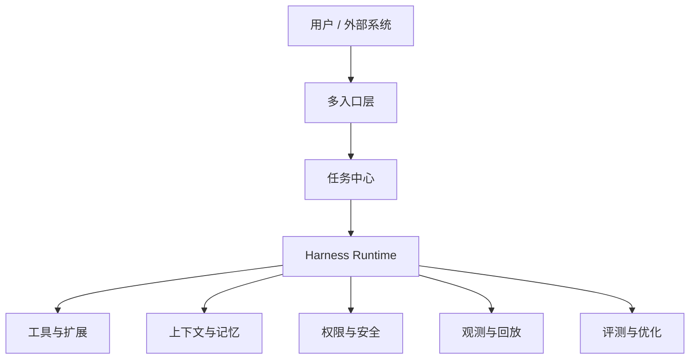

# Harness 工程产品设计思路与需求文档

## 1. 文档目的

本文档定义一个面向生产落地的大模型 Harness 产品的设计思路、用户场景、核心能力、产品需求和验收标准。

这里的 Harness 不是简单的 Agent 框架，也不是把 LLM API、工具调用和 Prompt 拼在一起的胶水层。它更接近一个「LLM 运行时操作系统」：负责把模型放进一个可控、可审计、可扩展、可评估的执行环境中，让大模型能够长期、安全、稳定地完成真实任务。

## 2. 产品定位

### 2.1 产品定义

Harness 产品是面向大模型 Agent 的运行时平台，提供以下能力：

- 接收用户目标，并将其转化为可执行的 Agent 任务。
- 管理 LLM 调用、工具调用、上下文、权限、安全、沙箱、观测和评测。
- 支持长任务、多工具、多模型、多 Agent、多入口和多外部系统集成。
- 将任务执行过程沉淀为可回放、可诊断、可改进的工程资产。

一句话定位：

> Harness 是连接「用户目标」和「可控 Agent 执行」之间的产品化运行时。

### 2.2 不做什么

产品不应定位为：

- 单纯的聊天机器人。
- 单纯的 Prompt 管理平台。
- 单纯的 LangChain / LangGraph / AutoGen 封装。
- 单纯的 MCP 工具市场。
- 单纯的 LLM 网关。

这些组件可以被 Harness 使用，但不能替代 Harness 产品本身。

## 3. 背景与问题

### 3.1 大模型 Agent 落地的核心矛盾

LLM 已经具备推理、规划、代码理解和工具调用能力，但生产环境仍存在明显断层：

- 模型会幻觉，不能直接信任其记忆。
- 工具调用有副作用，可能造成文件覆盖、数据修改、密钥泄露。
- 长任务会消耗大量上下文，容易丢失任务锚点。
- 工具越多，模型越容易选错。
- 外部系统接入复杂，权限与认证边界不清。
- 多 Agent 并发容易造成上下文污染、结果冲突和不可追踪。
- 执行过程不可观测时，无法解释失败原因，也无法做回归评测。

因此，真实产品需要的不只是「Agent 会调用工具」，而是「Agent 在受控运行时中完成任务」。

### 3.2 典型参考对象

本产品设计参考以下类型的实践：

- Codex / Claude Code：面向代码工程的本地或云端 Agent Harness。
- DeerFlow：面向深度研究和多 Agent 协作的 Harness。
- Alice 方法论：从 Agent Loop、工具、上下文、权限、MCP、Skill、安全、可观测性等角度梳理完整工程体系。

这些实践共同说明：Harness 的核心竞争力不在某个模型或某个工具，而在运行时闭环。

## 4. 目标用户与场景

### 4.1 目标用户

| 用户类型 | 核心诉求 |
|---|---|
| 个人开发者 | 用 Agent 辅助编码、调试、重构、文档和自动化任务 |
| 工程团队 | 将 Agent 接入代码库、CI、Issue、PR、知识库和内部工具 |
| AI 产品团队 | 构建自己的 Agent 应用和工作流平台 |
| 企业平台团队 | 提供统一的模型、工具、权限、安全和审计基础设施 |
| 研究 / 分析团队 | 执行长链路研究、资料整理、报告生成和多 Agent 协作 |

### 4.2 核心场景

1. **工程任务执行**
   - 读取代码库。
   - 定位问题。
   - 修改文件。
   - 运行测试。
   - 生成总结和变更说明。

2. **研究与报告**
   - 拆解研究目标。
   - 调用搜索、数据库、文档和知识库。
   - 多 Agent 并行调研。
   - 汇总结构化报告。

3. **企业内部自动化**
   - 接入 GitHub、Linear、Slack、Jira、Confluence、Notion、数据库等系统。
   - 执行审批流、数据查询、周报、巡检、工单处理。

4. **长任务与后台任务**
   - 持续执行数分钟到数小时。
   - 支持暂停、恢复、取消、检查点和失败重试。

5. **Agent 能力平台化**
   - 统一管理工具、Skill、模型、权限、Trace 和评测集。
   - 团队共享可复用工作流。

## 5. 产品设计原则

### 5.1 Harness Core 自研，外围能力可替换

Agent Loop、工具契约、权限系统、上下文策略、事件流、Trace Replay 和 Eval Gate 是产品核心，应由自研 Harness Core 掌握。

模型网关、向量库、MCP SDK、可观测性后端、沙箱执行环境、评测工具可以使用开源组件，并通过适配层接入。

### 5.2 默认保守，显式放行

所有有副作用的操作都必须经过明确的风险分级：

- 只读操作默认可自动执行。
- 写文件、执行命令、发送消息、修改外部系统等操作需要确认或规则放行。
- 高风险操作必须拒绝或强制人工确认。

### 5.3 不信任模型记忆，只信任工具事实

模型不能凭记忆修改外部状态。典型规则：

- 修改文件前必须读取目标文件。
- 编辑外部系统前必须获取当前状态。
- 工具结果必须进入上下文或结果引用，不能依赖模型声称「我知道」。

### 5.4 上下文按价值治理，不简单截断

上下文管理不是把窗口塞满，而是决定什么时候装什么：

- 任务目标和用户约束优先保留。
- 工具大结果可落盘并返回引用。
- 探索性中间过程可压缩。
- 历史记忆按相关性和可信度注入。

### 5.5 可观测性是产品能力，不是运维附属

每次执行都应可回答：

- Agent 做了什么？
- 为什么调用这个工具？
- 哪个模型参与了决策？
- 哪些权限被允许或拒绝？
- 上下文什么时候被压缩？
- 失败原因在哪一层？

### 5.6 所有优化必须进入闭环

产品必须支持：

- Trace 记录。
- Replay 回放。
- Eval 评测。
- 规则改进。
- Skill 版本化。
- 工具描述优化。
- 发布前回归。

## 6. 产品整体形态

### 6.1 多入口

| 入口 | 说明 |
|---|---|
| CLI | 面向开发者和自动化任务 |
| IDE 插件 | 面向代码编辑、diff review、测试运行 |
| Web 控制台 | 面向任务管理、配置、观测、评测 |
| Desktop App | 面向本地工作流、文件系统、浏览器和桌面工具 |
| API / SDK | 面向平台集成和二次开发 |
| Slack / IM / Issue 系统 | 面向团队协作入口 |

### 6.2 核心产品模块

## 7. 功能需求

### 7.1 任务中心

任务中心负责管理用户目标和 Agent 执行生命周期。

**需求：**

- 创建任务：支持自然语言目标、文件、链接、Issue、PR、Slack thread 等上下文输入。
- 任务状态：`pending`、`planning`、`running`、`waiting_approval`、`completed`、`failed`、`cancelled`。
- 任务控制：暂停、恢复、取消、重试、从检查点继续。
- 任务产物：文本回答、文件变更、报告、PR、外部系统操作记录。
- 任务历史：按项目、用户、时间、标签检索。

**验收标准：**

- 用户可以查看每个任务的状态、执行步骤和最终产物。
- 长任务中断后可以从最近检查点恢复。
- 失败任务可以定位失败阶段和错误原因。

### 7.2 Agent Loop

Agent Loop 是 Harness 的执行核心。

**需求：**

- 支持 LLM 流式调用。
- 支持工具调用解析、执行和结果回写。
- 支持最大迭代次数、用户取消、不可恢复错误和无进展终止。
- 支持多工具并发执行，但受工具并发安全声明约束。
- 支持事件流输出，供 UI、日志、Trace 和 Replay 消费。

**验收标准：**

- 不会无限调用工具。
- 用户可以中途取消。
- 工具执行失败后模型能收到明确错误并决定下一步。
- 事件流可完整还原执行过程。

### 7.3 工具系统

工具系统负责统一管理内置工具、MCP 工具、插件工具和 Skill 派生工具。

**需求：**

- 工具必须声明名称、描述、输入 Schema、输出约束、权限等级、只读性、并发安全性。
- 支持工具分层加载：核心工具、能力工具、扩展工具。
- 支持工具禁用和执行层二次校验。
- 支持工具输出过大时落盘或摘要。
- 支持工具调用统计和错误分析。

**验收标准：**

- 模型不会看到被禁用工具。
- 即使模型伪造工具调用，被禁用工具也不会执行。
- 大结果不会直接污染上下文。
- 工具调用失败能被 Trace 记录。

### 7.4 权限与审批

权限系统负责在 Agent 行动前控制风险。

**需求：**

- 支持多种权限模式：
  - 只读规划模式。
  - 默认确认模式。
  - 接受编辑模式。
  - 自动模式。
  - 受控绕过模式。
- 支持按工具、路径、命令、外部服务、项目设置规则。
- 支持一次允许、当前会话允许、当前项目允许。
- 支持审批记录和审计日志。

**验收标准：**

- 文件写入、命令执行、外部系统修改默认不会静默发生。
- 用户能看到为什么需要确认。
- 审批记录可回放。

### 7.5 沙箱与执行环境

执行环境负责隔离危险操作。

**需求：**

- 本地任务支持 workspace-write、read-only、full-access 等模式。
- 云端任务支持隔离容器或微虚拟机。
- 支持网络白名单、私网访问控制和敏感路径禁止读取。
- 支持命令超时、输出限制和退出码记录。

**验收标准：**

- Agent 无法越权读取或写入配置外路径。
- 网络访问默认受限。
- 高风险命令需要审批或被拒绝。

### 7.6 上下文与记忆

上下文层负责当前任务的信息治理，记忆层负责跨任务信息沉淀。

**需求：**

- 支持 token 估算。
- 支持分层压缩。
- 支持工具大结果引用。
- 支持项目记忆、用户偏好、长期语义记忆。
- 支持记忆写入延迟到任务结束后。
- 支持记忆查看、编辑、删除和禁用。

**验收标准：**

- 长任务不会因简单截断丢失初始目标。
- 记忆不会在同一轮对话中自我强化。
- 用户可以管理自己的记忆。

### 7.7 MCP 与插件

扩展层负责接入外部能力。

**需求：**

- 支持 MCP server 注册、启用、禁用、认证配置。
- 支持 MCP 工具懒加载和连接状态展示。
- 支持插件打包 Skill、工具、MCP 配置和 UI 元数据。
- 支持工具市场或团队内共享。

**验收标准：**

- 外部 MCP server 失败不会影响 Harness 启动。
- 第三方工具默认需要保守权限。
- 用户能知道工具来自哪个 server 或插件。

### 7.8 Skill 系统

Skill 负责沉淀可复用流程。

**需求：**

- Skill 使用 Markdown + 元数据定义。
- 支持显式调用和语义触发。
- 支持触发条件和不适用条件。
- 支持工具白名单。
- 支持版本备份、diff、回滚。
- 支持执行后提出改进建议，但必须用户确认后生效。

**验收标准：**

- Skill 不会全量常驻上下文。
- 高风险 Skill 不能自动误触发。
- Skill 更新可回滚。

### 7.9 多 Agent 协作

多 Agent 模块负责并行探索、分工执行和结果汇总。

**需求：**

- 支持子 Agent 创建、角色配置、工具限制和上下文隔离。
- 支持并行只读任务。
- 支持写操作串行化或冲突检测。
- 支持子 Agent 结果摘要回传主 Agent。

**验收标准：**

- 子 Agent 的中间噪声不会污染主上下文。
- 子 Agent 权限不能高于父任务授权范围。
- 多 Agent 结果可追踪来源。

### 7.10 可观测性与回放

可观测性模块负责记录、分析和复现 Agent 行为。

**需求：**

- 记录 LLM 调用、工具调用、权限判断、上下文压缩、子 Agent 生命周期。
- 支持 trace ID、任务 ID、agent ID、tool call ID。
- 默认只记录元数据，详细内容需显式开启。
- 支持任务 replay 和失败诊断。

**验收标准：**

- 每次任务都能看到调用链。
- 可以定位成本、延迟和失败来源。
- 可以基于历史 trace 构造评测样本。

### 7.11 评测与质量门禁

评测模块负责将真实任务转化为可回归测试资产。

**需求：**

- 支持从 trace 生成 replay case。
- 支持 Prompt 回归测试。
- 支持工具选择准确率评估。
- 支持端到端任务成功率评估。
- 支持发布前质量门禁。

**验收标准：**

- 关键任务流有固定评测集。
- 模型、Prompt、Skill、工具描述变更前后可对比。
- 质量下降时阻止发布。

## 8. 非功能需求

### 8.1 安全

- 默认不允许无审计的副作用操作。
- 敏感信息必须脱敏。
- API Key、Token 等凭证加密存储。
- 外部渠道输入默认低信任。

### 8.2 可靠性

- Agent Loop 必须有终止条件。
- 工具调用必须有超时。
- 长任务必须有检查点。
- 外部工具失败不能导致系统整体不可用。

### 8.3 可扩展性

- 支持插件化工具。
- 支持多模型供应商。
- 支持多入口。
- 支持团队级配置。

### 8.4 可维护性

- Harness Core 与开源组件通过适配层解耦。
- 所有核心决策有结构化日志。
- Skill、Prompt、工具描述版本化。

## 9. MVP 范围

### 9.1 必须包含

- 单 Agent Loop。
- 内置文件读写、搜索、命令执行工具。
- 基础权限确认。
- LiteLLM 或 Provider SDK 接入。
- 简单上下文压缩。
- Trace 元数据记录。
- Markdown Skill。
- MCP client 基础支持。
- Web / CLI 至少一个入口。

### 9.2 暂不包含

- 完整插件市场。
- 自动 Skill 改进。
- 企业级多租户。
- 复杂多 Agent 写操作。
- 完整云端沙箱集群。
- 大规模评测平台。

## 10. 产品路线图

### 阶段一：可靠单体 Harness

目标：让单 Agent 能安全完成工程任务。

- Agent Loop。
- 工具契约。
- 权限审批。
- 文件编辑保护。
- 基础 Trace。

### 阶段二：可扩展 Harness

目标：支持外部工具、Skill 和多模型。

- MCP。
- Skill。
- 模型路由。
- 工具分层加载。
- 上下文压缩。

### 阶段三：长任务与团队协作

目标：支持真实团队工作流。

- 任务中心。
- 检查点恢复。
- 多入口。
- 子 Agent。
- 团队工具和权限配置。

### 阶段四：质量闭环与自进化

目标：让 Harness 越用越稳。

- Trace Replay。
- Eval Gate。
- Skill 改进建议。
- 工具描述优化。
- 成本和质量分析。

## 11. 成功指标

| 指标 | 说明 |
|---|---|
| 任务成功率 | 用户目标是否最终完成 |
| 人工干预次数 | 同类任务需要多少次审批或纠正 |
| 工具选择准确率 | 模型是否调用正确工具 |
| 上下文压缩后成功率 | 压缩是否影响任务完成 |
| 回放通过率 | 历史任务在新版本下是否仍可成功 |
| 单任务成本 | token、工具调用、沙箱执行成本 |
| 安全事件数 | 越权、误写、密钥泄露、危险命令等事件 |

## 12. 总结

Harness 产品的本质是建立「大模型行动能力」和「工程可控性」之间的桥梁。它不是为了让模型做更多事情，而是让模型做事时更可靠、更透明、更可恢复。

完整产品必须闭合执行、安全、上下文、工具、Skill、观测和评测这些循环。只要这些循环没有闭合，产品就仍然停留在 Agent Demo 阶段；只有这些循环闭合后，Harness 才能成为可生产落地的工程平台。
