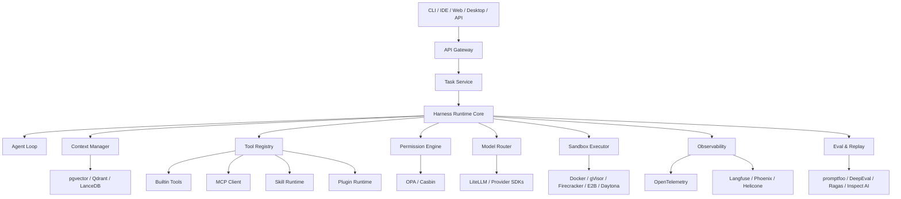
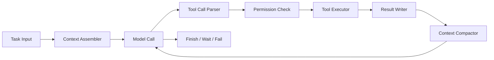
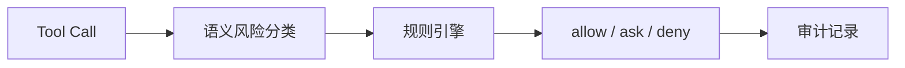
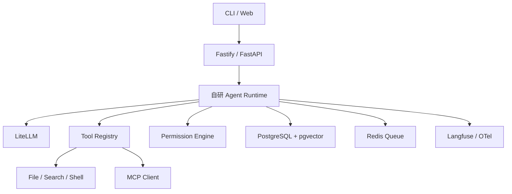
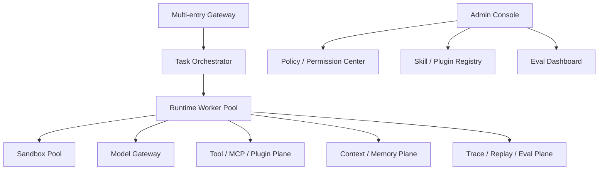

# Harness 工程产品技术选型与架构设计方案

## 1. 文档目的

本文档给出 Harness 工程产品的技术架构、组件选型、自研边界、关键接口和落地路径。

核心原则：

> 开源组件负责局部基础能力，自研 Harness Core 负责完整产品闭环。

不要为了选型而选型。技术选型必须服务于以下目标：

- 可控执行。
- 安全隔离。
- 可扩展工具生态。
- 可观测和可回放。
- 可评测和可迭代。
- 支持真实长任务和团队工作流。

## 2. 总体技术架构



## 3. 架构分层

### 3.1 接入层

负责接收用户请求和展示执行状态。

**可选技术：**

- CLI：Node.js、Python Typer、Go Cobra。
- Web：Next.js、React、Vue。
- Desktop：Electron、Tauri。
- IDE：VS Code Extension、JetBrains Plugin。
- API：FastAPI、Fastify、NestJS、Go HTTP。

**建议：**

MVP 阶段优先选择 CLI + Web Console。CLI 便于工程任务，Web Console 便于任务管理、Trace 和配置。

### 3.2 Task Service

负责任务生命周期和持久化。

**职责：**

- 创建任务。
- 记录任务状态。
- 管理检查点。
- 处理取消、恢复和重试。
- 关联 trace、产物、审批记录和评测结果。

**可选组件：**

- PostgreSQL：任务、事件、配置、审计记录。
- Redis：任务队列、短期缓存、锁。
- Temporal / BullMQ / Celery：后台任务调度。

**建议：**

- TypeScript 栈：PostgreSQL + Redis + BullMQ。
- Python 栈：PostgreSQL + Redis + Celery / Dramatiq。
- 如果长任务编排复杂，再引入 Temporal。

## 4. Harness Runtime Core

Runtime Core 是必须自研的核心模块。

### 4.1 为什么必须自研

LangGraph、AutoGen、CrewAI、LlamaIndex Workflows 等框架可以辅助搭建 Agent 流程，但它们无法完整覆盖产品级需求：

- 权限审批中断。
- 工具执行前后审计。
- 细粒度事件流。
- 用户取消和恢复。
- 上下文压缩策略。
- 工具输出落盘。
- Trace Replay。
- Skill 和 MCP 的统一治理。

因此，Runtime Core 应自研，并通过适配器复用开源框架能力。

### 4.2 Runtime Core 内部结构



### 4.3 核心接口

```ts
type AgentRunConfig = {
  taskId: string
  userId: string
  workspaceId: string
  modelProfile: string
  permissionMode: PermissionMode
  maxIterations: number
  maxTokens: number
}
```

```ts
type AgentEvent =
  | { type: "agent.started"; taskId: string }
  | { type: "llm.started"; model: string; purpose: string }
  | { type: "llm.delta"; text: string }
  | { type: "tool.requested"; callId: string; tool: string; input: unknown }
  | { type: "permission.required"; callId: string; risk: string }
  | { type: "tool.completed"; callId: string; outputRef?: string }
  | { type: "context.compacted"; beforeTokens: number; afterTokens: number }
  | { type: "agent.completed"; result: unknown }
  | { type: "agent.failed"; error: string }
  | { type: "agent.cancelled" }
```

该事件流是 UI、Trace、Replay、Eval 和审计系统的统一数据源。

## 5. 模型层选型

### 5.1 可选组件

| 组件 | 适用场景 | 局限 |
|---|---|---|
| LiteLLM | 多模型统一接口、代理、fallback、成本统计 | 不能替代业务侧模型能力治理 |
| Vercel AI SDK | 前端 / Node.js 流式体验 | 更偏应用层，不适合作为完整模型治理层 |
| OpenAI / Anthropic SDK | 直接接一线模型能力 | 多供应商治理需自研 |
| vLLM | 自托管开源模型推理 | 运维复杂，需要 GPU |
| Ollama | 本地模型开发测试 | 生产并发能力有限 |

### 5.2 推荐方案

MVP：

- LiteLLM 作为模型网关。
- 直接接 OpenAI / Anthropic / Gemini SDK 作为关键能力兜底。

生产：

- 自研 `ModelCapabilityRegistry`。
- LiteLLM 负责请求转发。
- Harness 负责场景级路由。

### 5.3 自研能力

```ts
type ModelCapability = {
  provider: string
  model: string
  maxContext: number
  supportsTools: boolean
  supportsVision: boolean
  supportsReasoning: boolean
  supportsJsonMode: boolean
  costTier: "low" | "medium" | "high"
  recommendedFor: Array<"chat" | "tool" | "memory" | "compress" | "judge">
}
```

**自研原因：**

不同模型是否支持工具调用、视觉、JSON、长上下文、reasoning 输出、流式格式都有差异。LiteLLM 可以统一调用格式，但不能替产品决定哪个模型适合哪个场景。

## 6. 工具系统选型

### 6.1 可选组件

| 组件 | 用途 |
|---|---|
| JSON Schema | 工具参数标准描述 |
| Zod / Pydantic | 参数校验和类型生成 |
| MCP SDK | 外部工具协议 |
| FastMCP | 快速开发 MCP Server |
| OpenAPI | 将 HTTP API 转换为工具 |

### 6.2 自研 Tool Registry

工具系统必须抽象成内部契约：

```ts
type ToolContract = {
  name: string
  displayName?: string
  description: string
  usageGuide?: string
  schema: JSONSchema
  source: "builtin" | "mcp" | "plugin" | "skill"
  readOnly: boolean
  destructive: boolean
  requiresApproval: boolean
  concurrency: "safe" | "exclusive" | "dynamic"
  outputLimitBytes: number
  timeoutMs: number
}
```

### 6.3 自研原因

开源工具框架通常只关心：

- 工具叫什么。
- 参数是什么。
- 怎么执行。

但 Harness 产品还需要知道：

- 是否只读。
- 是否有副作用。
- 能否并发。
- 是否允许在计划模式执行。
- 输出太大怎么办。
- 是否来自不可信 MCP server。
- 调用失败如何写回模型。

这些是产品运行时决策，必须自研。

## 7. MCP 与插件架构

### 7.1 MCP 选型

使用官方 MCP SDK 作为协议基础。

**开源覆盖：**

- MCP client / server 通信。
- stdio / HTTP transport。
- 工具发现。
- 基础调用协议。

**自研实现：**

- MCP server 注册中心。
- MCP 工具权限默认策略。
- MCP 工具描述截断。
- MCP 懒连接和健康检查。
- MCP 调用超时。
- MCP 工具结果大小限制。
- MCP server 信任分级。

### 7.2 插件系统

插件是比 MCP 更高一层的分发单元。

一个插件可以包含：

- Skill。
- MCP server 配置。
- 内置工具适配器。
- UI 元数据。
- 权限建议。
- 示例任务。

```json
{
  "name": "github-workflow",
  "version": "1.0.0",
  "skills": "./skills",
  "mcpServers": "./mcp.json",
  "permissions": "./permissions.json"
}
```

### 7.3 自研原因

MCP 解决「怎么连」，插件解决「怎么分发和治理」。团队级产品需要安装、启用、禁用、升级、审计和权限建议，这部分必须由 Harness 产品提供。

## 8. 上下文与记忆层选型

### 8.1 可选组件

| 能力 | 组件 |
|---|---|
| token 估算 | tiktoken、SharpToken |
| 文档切分 | LlamaIndex、LangChain Text Splitters |
| 代码解析 | tree-sitter、ast-grep |
| 关键词搜索 | ripgrep、Lucene、Meilisearch |
| 向量存储 | pgvector、Qdrant、Chroma、LanceDB、Milvus |
| RAG 框架 | LlamaIndex、Haystack、LangChain |

### 8.2 推荐方案

MVP：

- PostgreSQL + pgvector。
- ripgrep + tree-sitter。
- 自研上下文装配和压缩策略。

规模化：

- Qdrant 或 Milvus 承载大规模向量检索。
- Meilisearch / Elasticsearch 做关键词检索。

### 8.3 自研上下文策略

上下文管理需要自研：

```ts
type ContextItem = {
  id: string
  kind: "user_goal" | "message" | "tool_result" | "memory" | "file" | "skill" | "system"
  priority: number
  tokens: number
  retention: "must_keep" | "compressible" | "drop_if_needed"
}
```

压缩策略：

1. 移除低价值冗余信息。
2. 压缩大工具结果。
3. 折叠历史探索过程。
4. 保留用户目标、约束、最新状态和关键工具事实。

### 8.4 自研原因

向量库只能回答「语义上相关的内容是什么」，不能回答：

- 当前任务最关键的锚点是什么？
- 哪些工具结果可以丢？
- 哪些历史必须保留？
- 什么时候写入记忆？
- 删除记忆如何彻底生效？

这些是 Harness 的上下文策略，不是数据库能力。

## 9. 权限系统选型

### 9.1 可选组件

| 组件 | 用途 |
|---|---|
| OPA | 通用策略引擎 |
| Casbin | RBAC / ABAC 权限规则 |
| Cedar | 细粒度授权策略 |
| oso | 应用权限模型 |

### 9.2 推荐方案

使用「自研语义权限层 + OPA / Casbin 规则层」。



### 9.3 自研原因

传统权限系统控制的是资源：

- 用户 A 能否访问文件 B。
- 角色 C 能否调用接口 D。

Agent 权限控制的是意图：

- 「清理项目」是否可能删除文件？
- 「修复测试」是否允许执行命令？
- 「同步数据」是否会写外部系统？

因此需要自研语义风险层，将工具调用转换为权限决策输入。

## 10. 沙箱执行选型

### 10.1 可选组件

| 组件 | 适用场景 |
|---|---|
| Docker | MVP、本地隔离、CI 环境 |
| bubblewrap | Linux 本地轻量沙箱 |
| nsjail | 进程级安全隔离 |
| gVisor | 容器系统调用隔离 |
| Firecracker | 微虚拟机强隔离 |
| E2B | 托管代码执行沙箱 |
| Daytona | 开发环境和 Agent 沙箱 |

### 10.2 推荐方案

MVP：

- 本地：Docker 或 workspace 权限限制。
- 云端：Docker + 网络白名单。

生产：

- 高安全场景使用 gVisor / Firecracker。
- 快速产品化可接 E2B / Daytona。

### 10.3 自研边界

沙箱执行可以开源或托管，但以下必须自研：

- 工具到沙箱策略的映射。
- 文件系统挂载范围。
- 网络域名白名单。
- 命令输出大小限制。
- 执行前权限审批。
- 执行后审计和结果脱敏。

## 11. Skill 系统设计

### 11.1 可选组件

- Markdown。
- YAML frontmatter。
- Git 版本管理。
- Agent Skills spec。

### 11.2 Skill 文件格式

```md
---
name: code-review
description: 用于审查代码变更，不用于普通代码解释。
allowed_tools:
  - read_file
  - search_code
  - git_diff
activation:
  mode: semantic
  explicit_only: false
---

# Code Review Skill

按照以下流程审查代码：

1. 读取 diff。
2. 查找相关上下文。
3. 优先报告 bug、回归和安全风险。
4. 不输出无关风格建议。
```

### 11.3 自研能力

- Skill 触发判断。
- 不适用场景描述。
- 工具白名单。
- 版本备份。
- Diff 和回滚。
- 执行效果分析。

### 11.4 自研原因

Skill 是团队流程资产，不是简单 Prompt 片段。它需要权限、版本、治理和评测闭环。

## 12. 多 Agent 架构

### 12.1 可选组件

- AutoGen。
- CrewAI。
- LangGraph supervisor / swarm。
- MetaGPT。

### 12.2 推荐策略

MVP 不依赖复杂多 Agent 框架，先实现自研子 Agent 抽象：

```ts
type SubAgentSpec = {
  role: string
  objective: string
  allowedTools: string[]
  contextBudget: number
  writeAccess: boolean
}
```

### 12.3 执行原则

- 只读任务可以并行。
- 写任务默认串行。
- 子 Agent 上下文独立。
- 子 Agent 只返回摘要和证据引用。
- 子 Agent 权限不能高于父任务。

### 12.4 自研原因

多 Agent 的难点不是创建多个 Agent，而是：

- 防止上下文污染。
- 防止并发写冲突。
- 控制成本。
- 汇总结果。
- 追踪因果关系。

这些需要与 Harness Runtime 深度集成。

## 13. 可观测性选型

### 13.1 可选组件

| 组件 | 用途 |
|---|---|
| OpenTelemetry | Trace / Metrics / Logs 标准 |
| Langfuse | LLM 调用观测、Prompt、Dataset |
| Arize Phoenix | LLM trace、RAG 分析 |
| Helicone | LLM gateway logging |
| Prometheus / Grafana | 指标和面板 |
| Tempo / Jaeger | Trace 存储和查看 |

### 13.2 推荐方案

- OpenTelemetry 作为统一事件标准。
- Langfuse 或 Phoenix 做 LLM 观测面板。
- PostgreSQL 存储业务级 AgentEvent。
- Prometheus / Grafana 监控系统指标。

### 13.3 自研 Agent Trace

通用 LLM observability 不够，需要自研 Agent 语义事件：

- tool.selected。
- permission.decided。
- context.compacted。
- memory.injected。
- skill.activated。
- subagent.spawned。
- replay.started。

### 13.4 自研原因

普通 LLM trace 只知道 prompt、completion、token 和延迟。Harness 产品必须解释：

- 为什么用了这个工具？
- 为什么权限被拒绝？
- 压缩丢了什么？
- 哪个子 Agent 影响了最终决策？
- 这个失败能否在 replay 中复现？

## 14. 评测与 Replay

### 14.1 可选组件

| 组件 | 用途 |
|---|---|
| promptfoo | Prompt 回归 |
| DeepEval | LLM 应用评测 |
| Ragas | RAG 质量评估 |
| Inspect AI | 模型与任务评估 |
| Langfuse Dataset | 样本管理 |

### 14.2 自研 Replay Case

```ts
type ReplayCase = {
  id: string
  taskInput: unknown
  initialContext: unknown
  expectedBehavior: string
  allowedTools: string[]
  mockedToolResults?: Record<string, unknown>
  assertions: EvalAssertion[]
}
```

### 14.3 自研原因

Harness 的质量不只是回答好不好，而是过程是否正确：

- 是否调用正确工具？
- 是否遵守权限？
- 是否先读后写？
- 是否避免危险命令？
- 是否在压缩后仍完成任务？

这些必须从真实 trace 中沉淀 replay case。

## 15. 数据存储设计

### 15.1 推荐存储

| 数据 | 存储 |
|---|---|
| 任务、会话、事件 | PostgreSQL |
| 向量记忆 | pgvector / Qdrant |
| 临时结果 | S3 / MinIO / 本地对象存储 |
| 队列 | Redis |
| Trace 元数据 | PostgreSQL + OTel backend |
| Prompt / Skill 版本 | Git 或 PostgreSQL 版本表 |

### 15.2 核心表

- `tasks`
- `agent_runs`
- `agent_events`
- `tool_calls`
- `permission_decisions`
- `messages`
- `memories`
- `skills`
- `skill_versions`
- `replay_cases`
- `eval_runs`

## 16. 安全设计

### 16.1 可选组件

- detect-secrets。
- trufflehog。
- Presidio。
- Llama Guard。
- NeMo Guardrails。
- Guardrails AI。

### 16.2 自研安全策略

- 外部输入信任分级。
- 工具输出脱敏。
- LLM 输出脱敏。
- 敏感文件 deny list。
- 网络访问 allow list。
- 高风险命令阻断。
- 审批和审计。

### 16.3 原则

Guardrail 只能辅助，不能作为唯一安全边界。真正的安全边界必须来自：

- 权限判断。
- 沙箱隔离。
- 最小工具暴露。
- 数据脱敏。
- 审计回放。

## 17. 推荐技术栈

### 17.1 TypeScript 方案

| 层 | 技术 |
|---|---|
| API | Fastify / NestJS |
| Runtime | TypeScript 自研状态机 |
| Schema | Zod + JSON Schema |
| Model | LiteLLM + Provider SDK |
| Queue | BullMQ + Redis |
| DB | PostgreSQL + pgvector |
| UI | Next.js |
| Desktop | Electron / Tauri |
| Observability | OpenTelemetry + Langfuse |

适合：前后端一体、桌面产品、插件生态、开发效率优先。

### 17.2 Python 方案

| 层 | 技术 |
|---|---|
| API | FastAPI |
| Runtime | Python async generator |
| Schema | Pydantic |
| Model | LiteLLM + Provider SDK |
| Queue | Celery / Dramatiq |
| DB | PostgreSQL + pgvector |
| RAG | LlamaIndex / Haystack |
| Observability | OpenTelemetry + Langfuse |

适合：AI / 数据团队、RAG 重、Python 生态优先。

### 17.3 推荐

如果目标是做类似 Codex / Claude Code 的工程 Harness，推荐 TypeScript 优先：

- 更适合 CLI、IDE、Web、Desktop 统一生态。
- Zod 与 JSON Schema 集成顺畅。
- MCP TypeScript 生态成熟。
- 前后端共享类型成本低。

如果目标是研究型、多数据处理型 Harness，则 Python 更合适。

## 18. MVP 架构



MVP 必须实现：

- 单 Agent Loop。
- ToolContract。
- 基础权限审批。
- 文件先读后写保护。
- MCP client。
- LiteLLM 接入。
- Trace 元数据。
- 简单 Skill。
- pgvector 记忆。

## 19. 生产演进架构



生产阶段新增：

- 多 worker。
- 沙箱池。
- 插件市场。
- 团队权限中心。
- Trace Replay。
- Eval Gate。
- 成本分析。
- 多 Agent 调度。

## 20. 风险与对策

| 风险 | 对策 |
|---|---|
| 被 Agent 框架锁死 | Harness Core 自研，框架只做适配 |
| 工具过多导致模型误选 | 工具分层加载、工具搜索、描述评测 |
| 权限弹窗过多 | 权限模式、规则沉淀、风险分级 |
| 上下文压缩误删关键内容 | 任务锚点保护、压缩 replay、回归评测 |
| MCP server 不可信 | 默认 ask、server 信任分级、输出限制 |
| 模型行为升级后回归 | Replay case + Eval Gate |
| 沙箱逃逸或越权 | 最小挂载、网络白名单、敏感路径 deny |
| 可观测性泄露隐私 | 默认元数据、详细日志显式开启、脱敏 |

## 21. 实施路线

### 阶段一：核心运行时

- 自研 Agent Loop。
- 事件流。
- ToolContract。
- LiteLLM 接入。
- 内置工具。
- 基础权限。

### 阶段二：扩展与上下文

- MCP client。
- Skill Runtime。
- pgvector 记忆。
- 分层上下文压缩。
- 工具输出落盘。

### 阶段三：安全与观测

- 沙箱执行。
- OTel + Langfuse。
- 审批审计。
- 敏感信息过滤。
- Trace 页面。

### 阶段四：质量闭环

- Replay case。
- promptfoo / DeepEval 集成。
- Eval Gate。
- Skill 版本和回滚。
- 工具描述优化。

### 阶段五：团队与平台化

- 插件市场。
- 团队权限。
- 多入口。
- 多 Agent。
- 成本和质量面板。

## 22. 结论

Harness 工程产品的技术方案不应以某个开源 Agent 框架为中心，而应以自研 Runtime Core 为中心。

开源组件适合承担：

- 模型转发。
- 向量检索。
- MCP 协议。
- 沙箱执行。
- 可观测性后端。
- Prompt / RAG 评测。

自研部分必须承担：

- Agent Loop。
- Tool Contract。
- Permission Engine。
- Context Policy。
- Skill Runtime。
- Trace Replay。
- Eval Gate。

这些自研能力构成产品护城河。只有掌握这些部分，Harness 才能从 Demo 变成可生产落地、可持续演进的 Agent 工程平台。
